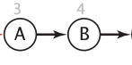
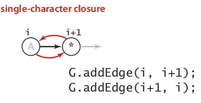
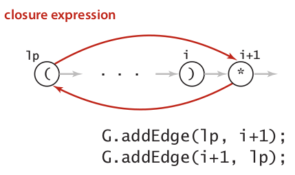
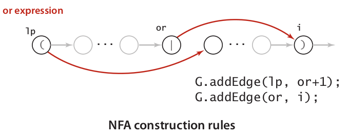
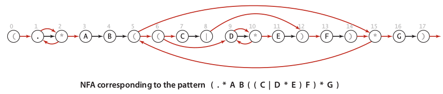

## Regular Expressions {#regular-expressions}

Regular Expressions stand on the language automaton and formal languages. The idea of Regular Expression \(RE\) similar to the idea of Knuth Morris Pratt \(KMP\) Algorithm, but the goal of Regular Expressions is try to find such a given pattern in a string while KMP only capable to find such substring. To do that, we need more abstract machine to capture expressive pattern that support necessary logic such as ‘or’ and repetition. We can construct such abstract machine by implementing **Nondeterministic** **Finite Automaton** \(**NFA**\) on **Digraph** structure. A term _nondeterministic_ refers that digraph might contains multiple path contrast to the construction of DFA which only has single path.

Similar to arithmetic symbol in mathematic, we can define such similar pattern in the languages as **syntax**. Table below give four patterns with examples:

**or = \|**

| Name | Notation | Match |
| --- | --- | --- |
| Concatenation | {A B} | AB |
| Or | A or B | A, B |
| Closure | AB\* | A, AB, ABBB |
| Parentheses | C \(AC or B\) D | CACD, CBD |

Table 1: Language patterns

Another important feature of language is **shortcut** expression. Using a certain shortcut can save us from being type unnecessary long expression. Table below give example of shortcuts:

| Name | Notation | Example | Shortcut for | Match |
| --- | --- | --- | --- | --- |
| Wildcard | . | A . B |  |  |
| Specified Set | _Enclosed in_ \[\] | \[AEIOU\]\* |  |  |
| Range | _Enclosed in_ \[\] _separated by_ - | \[A-Z\] |  |  |
| Complement | _Enclosed in_ \[\] _separated by_ ^ | \[^AEIOU\]\* |  |  |
| At least 1 | + | \(AB\)+ | \(AB\)\(AB\)\* | AB ABABAB |
| O or 1 | ? | \(AB\)? | ‘any’ \| AB | ‘any’ AB |
| Specific | Count in {} | \(AB\){3} | \(AB\)\(AB\)\(AB\) | ABABAB |
| Range | Range in {} | \(AB\){1-2} | \(AB\) \| \(AB\)\(AB\) | AB ABAB |

Table 2: Shortcut expression

Building an NFA corresponding to an RE is similar to constructing arithmetic expression using Djikstra’s two-stack algorithm. The differences to Djikstra are:

* RE does not have an explicit operator for concatenation.

* RE have a unary operator, for closure \(\*\)

* RE have only one binary operator, for or \(\|\)

The basic NFA construction consist a digraph G and _epsilon_-transition \(transition in edge without scanning text\). Below the description of basic rule to construct NFA for RE:

* **Concatenation** is every match transition.

  

* Use stack to handle **Parentheses**: Push each left parenthesis on the stack and pop each time encountered with right parenthesis.

* Handle **Closure** in two condition: After single character or after right parenthesis.

  



* Handle **Or expression** by implementing two _epsilon_-transition.



An image below illustrated a full NFA of RE _\(.AB\(\(C\|DE\)F\)\*G\)_



Below the implementation of NFA of RE in java:

```
public class NFA
{
    private char[] re;        // Match transitions
    private Digraph G;        // Epsilon transitions
    private int M;            // Number of states

    public NFA(String regexp)
    {
        Stack<Integer> ops = new Stack<Integer>();
        re = regexp.toCharArray();
        M = re.length;
        G = new Digraph(M+1);

        for (int i = 0; i < M; i++) {
            int lp = i;

            if (re[i] == '(' || re[i] == '|')
                ops.push(i);
            else if (re[i] == ')') {
                int or = ops.pop();
                if (re[or] == '|') {
                    lp = ops.pop();
                    G.addEdge(lp, or+1);
                    G.addEdge(or, i);
                } else {
                    lp = or;
                }
            }

            if (i < M-1 && re[i+1] == '*') {
                G.addEdge(lp, i+1);
                G.addEdge(i+1, lp);
            }

            if (re[i] == '(' || re[i] == '*' || re[i] == ')')
                G.addEdge(i, i+1);
        }
    }

    public boolean recognizes(String txt)
    {
        Bag<Integer> pc = new Bag<Integer>();
        DirectedDFS dfs = new DirectedDFS(G, 0);

        for (int v = 0; v < G.V(); v++)
            if (dfs.marked(v)) pc.add(v);

        for (int i = 0; i < txt.length(); i++) {
            Bag<Integer> match = new Bag<Integer>();

            for (int v : pc)
                if (v < M)
                    if (re[v] == txt.charAt(i) || re[v] == '.')
                        match.add(v+1);

            pc = new Bag<Integer>();
            dfs = new DirectedDFS(G, match);

            for (int v = 0; v < G.V(); v++)
                if (dfs.marked(v)) pc.add(v);
        }

        for (int v : pc)
            if (v == M) return true;

        return false;
    }
}
```

The critical transition of constructing NFA is when we dealing with right parenthesis. Similar to Djikstra two-stack, we need to store every meta character “\*, \|, \(” into stack. When hit right parenthesis character ‘\)’, we popped out item in the stack, but if popped out character is ‘\|’, we need extra handling to do _or_ _operation_ which is has two _epsilon_-transition.

The total running time of our implementation of Regular Expression using NFA would be **MN** which is M time for constructing NFA and N time for doing scanning over text.

